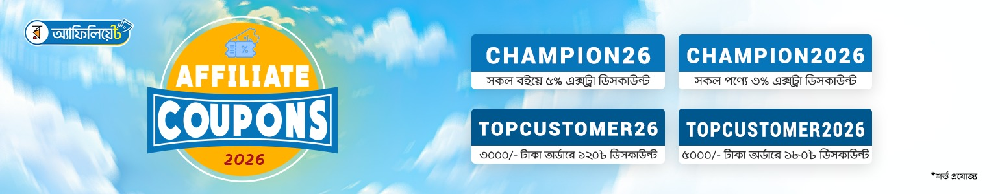

<!-- HERO + SHORT INTRO -->
<section class="container home-hero">
  

    <h1 class="page-title">Rokomari Promo Code – আজকের কুপন ও ডিসকাউন্ট</h1>
    

      <strong>Rokomari promo code</strong> আর খুঁজতে খুঁজতে সময় নষ্ট করতে হবে না। এখানে পাবেন
      বই, ইলেকট্রনিক্স, ফার্নিচার, ফুড, কিডস টয়স, বিউটি সহ প্রায় সব ক্যাটাগরির হালনাগাদ
      <em>Rokomari coupon code</em> ও ডিসকাউন্ট অফার – এক জায়গাতেই।
    

    <a href="#today-deals" class="btn-primary">আজকের সব অফার দেখুন</a>
    <a href="#coupons" class="btn-primary">আজকের কুপন দেখুন</a>
    <a href="#how-to-use" class="btn-primary">কিভাবে ব্যবহার করবনে</a>
  

</section>

<!-- LONGER INTRO / EXPLAINER -->
<section class="container home-intro">
  

    রকমারিতে অর্ডার করার আগে একবার এই পেইজে এসে আপডেটেড কোড দেখে নিলে অনেক সময় ১০–৫০% পর্যন্ত
    বাড়তি সেভ করা যায়। আমরা নিয়মিতভাবে নতুন কুপন, bank offer এবং season-based
    <strong>রকমারি ডিসকাউন্ট</strong> যোগ করি, যাতে কোনো বেস্ট ডিল মিস না হয়।
  

</section>

<!-- JSON-BASED CARD ROWS (HORIZONTAL) -->
<section id="today-deals" class="container home-deals" aria-label="আজকের Rokomari promo code">
  <h2>আজকের Rokomari promo code – ক্যাটাগরি অনুযায়ী</h2>
  

    নিচের সেকশনগুলোতে বই, ইলেকট্রনিক্স, ফুড, কিডস টয়সসহ বিভিন্ন ক্যাটাগরির best deals এক নজরে সাজানো আছে।
    স্ক্রল বা ড্র্যাগ করে কার্ডগুলো ঘুরে দেখুন, আর শেষের <strong>“আরও দেখুন”</strong> বাটনে ক্লিক করলে
    সেই ক্যাটাগরির ডেডিকেটেড পেইজে চলে যাবেন।
  

<!-- CATEGORY SHORTCUT GRID -->
<section class="container home-categories" aria-label="Rokomari promo code categories">
  <h2>কোন ক্যাটাগরির Rokomari promo code খুঁজছেন?</h2>
  

    নিচের লিংকগুলোর যেকোনো একটি বেছে নিলেই আপনি সেই ক্যাটাগরির ডেডিকেটেড ডিসকাউন্ট পেইজে চলে যাবেন।
    প্রতিটি পেইজেই থাকছে এক জায়গায় সব <strong>Rokomari discount</strong>, ব্যবহারবিধি ও প্রায়শই জিজ্ঞাসিত প্রশ্ন।
  

  <ul class="category-link-grid">
    <li><a href="{{ '/rokomari-books/' | relative_url }}">📚 বইয়ের Rokomari promo code</a> – উপন্যাস, ইসলামিক, একাডেমিক, মোটিভেশনালসহ সব বই ক্যাটাগরি।</li>
    <li><a href="{{ '/rokomari-electronics/' | relative_url }}">💡 ইলেকট্রনিক্স ডিসকাউন্ট</a> – গ্যাজেট, ডিভাইস ও এক্সেসরিজে স্পেশাল অফার।</li>
    <li><a href="{{ '/rokomari-foods/' | relative_url }}">🍱 ফুড &amp; গ্রোসারি অফার</a> – ফুড আইটেম ও কনজিউমেবল পণ্যে কুপন কোড।</li>
    <li><a href="{{ '/gorer-bazar/' | relative_url }}">🏠 গৃহস্থালি / গোরের বাজার</a> – ডেইলি প্রয়োজনীয় সব জিনিসে সেভ করার সুযোগ।</li>
    <li><a href="{{ '/rokomari-kids-toys/' | relative_url }}">🧸 Kids Toys promo code</a> – বাচ্চাদের খেলনা, গেম ও ক্রিয়েটিভ লার্নিং প্রোডাক্ট।</li>
    <li><a href="{{ '/rokomari-baby-products/' | relative_url }}">👶 Baby products ডিসকাউন্ট</a> – ডায়াপার, বেবি কেয়ার ও এসেনশিয়াল পণ্য।</li>
    <li><a href="{{ '/rokomari-beauty/' | relative_url }}">💄 Beauty &amp; personal care</a> – মেক-আপ, স্কিন কেয়ার, হাইজিন পণ্য।</li>
    <li><a href="{{ '/rokomari-others/' | relative_url }}">🎁 Others / মিক্সড অফার</a> – গিফট আইটেম, স্টেশনারি ও বিভিন্ন মিশ্র ক্যাটাগরি।</li>
    <li><a href="{{ '/rokomari-best-seller/' | relative_url }}">🔥 Best Seller Rokomari promo code</a> – সব ক্যাটাগরির সবচেয়ে বেশি বিক্রি হওয়া পণ্যের বাছাই অফার।</li>
  </ul>
</section>
<!-- <section id="coupons">
  
  
Last update : January 20, 2026

</section> -->

<!-- HOW TO USE PROMO CODE -->
<section class="container home-guide" id="how-to-use">
  <h2>কীভাবে Rokomari promo code ব্যবহার করবেন? (Step-by-step)</h2>
  

    নতুন বা পুরনো যেই ক্রেতাই হন, সঠিকভাবে কোড ব্যবহার না করলে অনেক সময় ডিসকাউন্ট প্রযোজ্য হয় না।
    নিচের সহজ ধাপগুলো Follow করলেই <strong>Rokomari coupon</strong> সব সময় কাজ করবে:
  

  <ol class="ordered-list">
    <li>
      <strong>১. পণ্য সিলেক্ট করুন:</strong>
       প্রথমে রকমারি প্রোমো কোড সাইট থেকে আপনার পছন্দের বই বা পণ্য খুজুন। না পেলে উপরে সার্চবারে সার্চ করুন এবং লিংকে গিয়ে পণ্যটি কার্টে যোগ করুন। আপনার পণ্যটি খুজে না পেলে আমাদেরকে মেসেজ দিন।
    </li>
    <li>
      <strong>২. সর্বশেষ কোড কপি করুন:</strong>
       যে কুপনের শর্ত আপনার অর্ডারের সাথে মিলে যায় তা বেছে নিয়ে “কপি” করুন।
    </li>
    <li>
      <strong>৩. Checkout পেইজে কোডটি বসান:</strong>
       রকমারির Checkout পেইজে <em>“Apply Coupon / Promo Code”</em> বক্সে কপি করা কোড Paste করে Apply দিন।
    </li>
    <li>
      <strong>৪. ডিসকাউন্ট ঠিকমতো কমেছে কি না দেখুন:</strong>
       Order Summary-তে Price কমেছে কি না এবং শর্ত অনুযায়ী Cash back / Free shipping এসেছে কি না মিলিয়ে নিন।
    </li>
  </ol>

<strong>বিঃদ্রঃ আমাদের দেওয়া কুপন কোডগুলো উপরে দেওয়া পণ্যের [Buy Now] বাটনে ক্লিক করার পর পণ্য কিনলে অথবা যেকোনো পণ্যের [Buy Now] বাটনে ক্লিক করার পর রকমারির অন্য যে কোনো পণ্য কিনলে কুপন গুলো ব্যবহার করা যাবে।</strong>

</section>

<!-- VALUE PROPOSITION -->
<section class="container home-guide">
  <h2>আমাদের Rokomari promo code হাব থেকে কী ভ্যালু পাচ্ছেন?</h2>
  

    শুধুই কোড কপি-পেস্ট করার তালিকা নয় – আমরা চেষ্টা করি প্রত্যেক ক্যাটাগরি পেইজকে একটি পূর্ণাঙ্গ
    <strong>কুপন গাইড</strong> বানাতে, যাতে আপনি জানতে পারেন:
  

  <ul class="bullet-list">
    <li>কোন <strong>Rokomari discount</strong> বর্তমানে একটিভ, কোনটি Expire।</li>
    <li>প্রতিটি কোডের শর্ত – ক্যাটাগরি, মিনিমাম অর্ডার, ইউজার টাইপ (নতুন/পুরনো)।</li>
    <li>বই কেনার জন্য আলাদা Buying guide, যেমন কোন ধরণের পাঠকের জন্য কোন বই ভালো হতে পারে।</li>
    <li>Shipping, delivery time ও রিটার্ন/রিফান্ড সম্পর্কিত হালনাগাদ তথ্য।</li>
    <li>Seasonal campaign (Pohela Boishakh, Eid, Book Fair ইত্যাদি) চলাকালীন আলাদা হাইলাইট।</li>
  </ul>
  

    এর ফলে Google-এর চোখে পেইজগুলো শুধুমাত্র “thin affiliate content” না হয়ে,
    বাস্তবিক অর্থেই <strong>ব্যবহারকারীর জন্য ইনফরমেটিভ ও ভ্যালু-ড্রিভেন</strong> হয়ে দাঁড়ায়।
  

</section>

<!-- EXTRA SAVING TIPS -->
<section class="container home-guide">
  <h2>Rokomari promo code দিয়ে আরও কীভাবে সেভ করবেন?</h2>
  
নিচের ছোট ছোট টিপসগুলো Follow করলে একই অর্ডারে আরও কিছু বাড়তি টাকা সেভ করা যায়:

  <ul class="bullet-list">
    <li><strong>Wish-list বানিয়ে রাখুন:</strong> প্রিয় বই বা পণ্যগুলো Wish-list এ রেখে দিন, ভালো <em>Rokomari coupon</em> এলে একসাথে অর্ডার করুন।</li>
    <li><strong>বড় অর্ডারের জন্য কম কুপন নষ্ট করুন:</strong> অনেক কোডই step discount দেয় (যেমন ১০০০ টাকায় ১০%, ২০০০ টাকায় ১৫%) – তাই ছোট ছোট অর্ডার ভাগ না করে নির্দিষ্ট সীমা মেইন্টেইন করে অর্ডার করলে সেভ বেশি হয়।</li>
    <li><strong>Festival sale মিস না করুন:</strong> Book Fair, Eid, 21st Feb, 16th Dec ইত্যাদিতে রকমারি আলাদা মেগা ক্যাম্পেইন চালায় – তখন আমাদের সাইটে বিশেষ সেকশন থাকে।</li>
    <li><strong>Expired code চেক করুন:</strong> কখনও কখনও Rokomari পুরনো কোড আবার রিঅ্যাকটিভ করে; তাই “expired” ট্যাগ দেখলেও আমরা নোট দিয়ে রাখি যদি আবার একটিভ হওয়ার সম্ভাবনা থাকে।</li>
  </ul>
</section>
